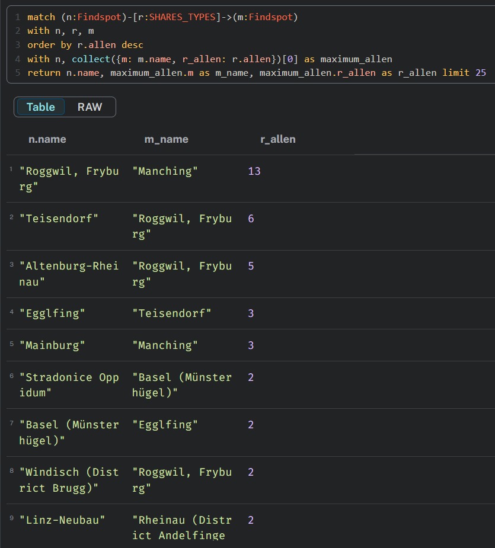

# Git

Alle Unterlagen, Daten und Code:

[https://github.com/rigby132/coinkings](https://github.com/rigby132/coinkings)

# Inhalt

- Recap
- Neo4j
- Frontend
- Ergebnisse
- Ausblick

# Recap

Plan der CoinKings

- SNA Tool
  - WebApp

  { width=20% }

  - Visualisierung

  { width=20% }

  - Graphdatenbank

  { width=20% }

# Neo4j

# Neo4j
Wie bildet man die Daten in Neo4j ab?

# Neo4j
Knoten:

- Münzen

- Fundorte

- Typen

- Stempel

# Neo4j
Kanten:

- Münzen --- Fundorte

- Münzen --- Typen

- Münzen --- Stempel

# Neo4j
Daten in neo4j bekommen

- Direkt einlesen (schwierig)

- Vorbereiten und dann einlesen (einfach)

# Neo4j
  

# Neo4j
  

# Neo4j
  

# Neo4j
  { width=50% }

# Neo4j
  

# Neo4j
  

# Neo4j
  

# Neo4j
  

# Neo4j
  
  
# Neo4j
  

# Neo4j
  { width=50% }

# Neo4j
  Es fehlen noch Kanten zwischen Fundorten.

# Neo4j
  Weitere Kanten:

  - Typgleiche Münzen
  
  - Visuelle Ähnlichkeit

# Neo4j
  Kanten erstellen:

  

  Kantengewicht setzen:

  

# Neo4j
  

# Neo4j

# Neo4j
  Neo4j Graph Datascience Library (GDS)

   - Community Detection

# Neo4j
  

# Neo4j
  

# Frontend

# Frontend

NVL

# Frontend

NVL

# Frontend

User Interface

# Frontend

# Frontend

# Frontend

{ width=28% }

# Frontend

{ width=28% }

# Frontend

{ width=28% }

# Frontend

{ width=28% }

# Ergebnisse

# Ergebnisse

Ostgruppe vs Westgruppe

# Ergebnisse

# Ergebnisse

# Ergebnisse

Visuelle Ähnlichkeit

# Ergebnisse

# Ergebnisse

{ width=50% }

# Ergebnisse

# Ergebnisse

{ width=50% }

# Ergebnisse

# Ergebnisse

# Ergebnisse

{ width=50% }

# Ergebnisse

{ width=60% }

# Ergebnisse

Typengleichheit

# Ergebnisse

# Ergebnisse

# Ergebnisse

{ width=60% }

# Ergebnisse

{ width=60% }

# Ergebnisse

{ width=60% }

# Ergebnisse

Veröffentlichung

# Ergebnisse

# Ausblick

# Ausblick
Grundlegende Verbesserungen:

- Effizienz
- Darstellung
- Benutzerfreundlichkeit
- Weitere Datensätze

# Ausblick
2 mögliche Wege:

- Analyse-Tool
- Visualisierungs-Tool

